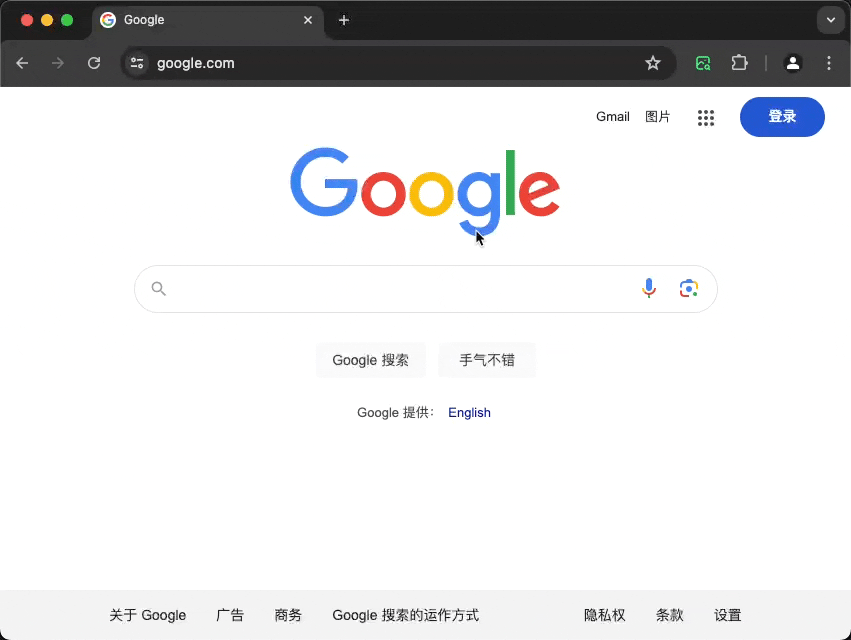

 

<h3 align="center">preview-large-image</h3>

---

  a browser extension to preview large image

## 🧐 motivation

When I browse some websites, there the interaction with the picture is not very consistent, some have the function of providing a quick view of the big picture, some are fixed size picture layout, can not directly view the actual size of picture. It's annoyed to me.

## 🔧 Install

- go [release](https://github.com/liuxingyu521/extension-preview-large-image/releases) page, and download the `zip` file in Assets area, then decompress the file.

- Open the Chrome browser and go to `chrome://extensions/`, and enable Developer Mode.

- Click the `Load unzipped extensions` button and select the folder you just extracted

## 🎈 Usage

just right click the image element,then select the `preview the large image`

## ⛏️ Built Using

- [Wxt](https://wxt.dev/) - the extension framework
- [viewerjs](https://github.com/fengyuanchen/viewerjs) - preview image tool

## ✍️ Authors

- [@liuxingyu521](https://github.com/liuxingyu521) - Idea & Initial work

See also the list of [contributors](https://github.com/liuxingyu521/extension-preview-large-image/contributors) who participated in this project.
