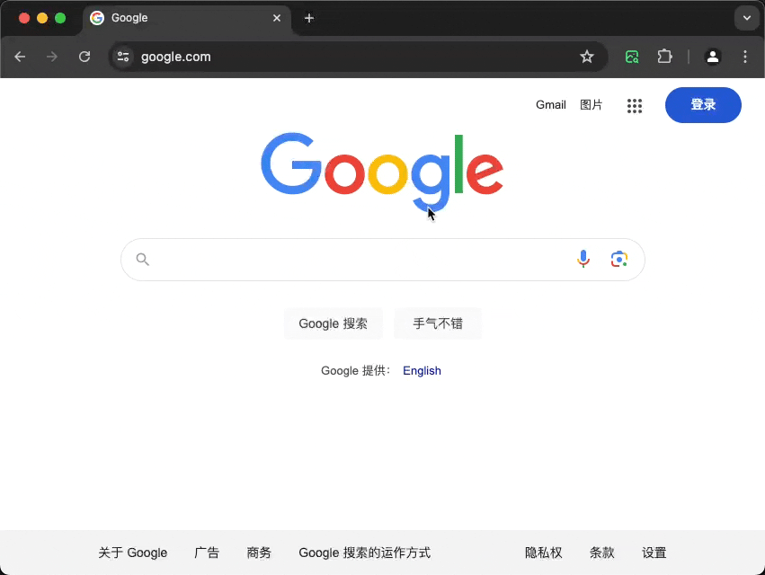

  

<h3 align="center">preview-large-image</h3>

[English](./README.en.md) | 简体中文

---

  一个用于预览大图的浏览器扩展

## 🧐 动机

浏览一些网站时，图片的交互体验并不一致：有的网站提供快速查看大图的功能，有的则使用固定尺寸的图片布局，无法直接查看图片的实际大小，这让我感到困扰。

## 🔧 安装

- 前往 [release](https://github.com/liuxingyu521/extension-preview-large-image/releases) 页面，在 Assets 区域下载 `zip` 文件并解压。

- 打开 Chrome 浏览器，进入 `chrome://extensions/`，并开启开发者模式。

- 点击「加载已解压的扩展程序」按钮，选择刚刚解压的文件夹。

## 🎈 使用

右键点击图片或内联 SVG 元素，选择「预览大图」即可。

## 🖼️ 图片 / 视频接管

### 动机

想直接预览图片或视频时，如果响应头带有 `Content-Disposition: attachment`，浏览器会直接下载到本地而非预览，这很困扰我。

当你直接访问图片或视频 URL，且服务器返回 `Content-Disposition: attachment` 时，扩展会将你重定向到内置的预览页面，以便预览和下载该文件。

- 正常的、可直接预览的图片和视频仍保持浏览器原生预览。
- 可在扩展弹窗中分别开启或关闭图片与视频的接管。
- 同时支持 Chrome 和 Firefox。

## ⛏️ 技术栈

- [Wxt](https://wxt.dev/) - 扩展开发框架
- [viewerjs](https://github.com/fengyuanchen/viewerjs) - 图片预览工具

## ✍️ 作者

- [@liuxingyu521](https://github.com/liuxingyu521) - 想法与初始开发

另见参与此项目的[贡献者](https://github.com/liuxingyu521/extension-preview-large-image/contributors)列表。
